# Booking Hotel Application

This is a booking hotel application built with React. It allows users to search for hotels, view hotel details, and make bookings.
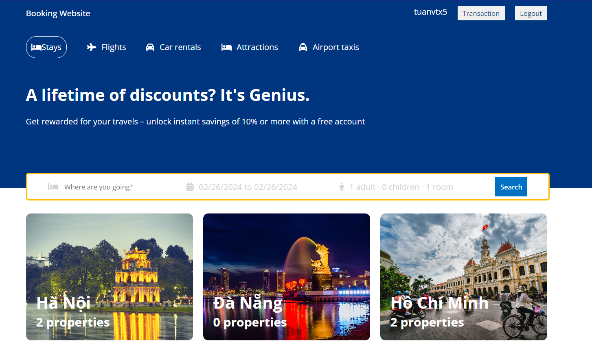
This application include 3 side: frond-end: client & admin; backend: api (using express.js)

You can download to using my web application

## Client Features

- Hotel search: Users can search for hotels based on location, dates, and other criteria.
  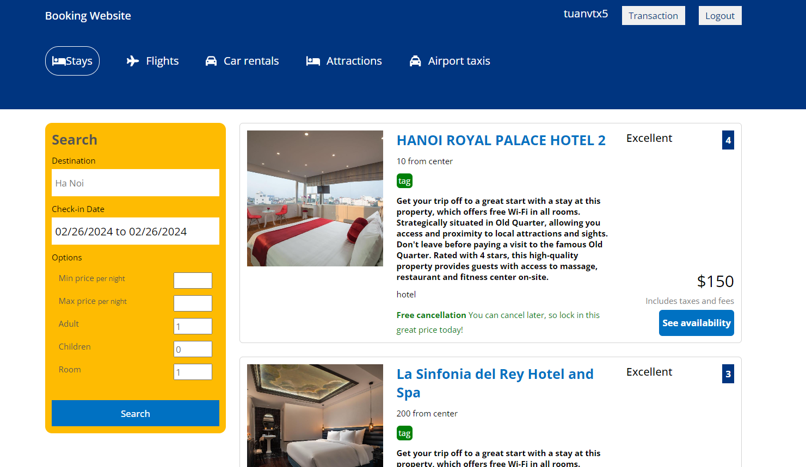
- Hotel details: Users can view detailed information about each hotel, including amenities, photos, and reviews.
  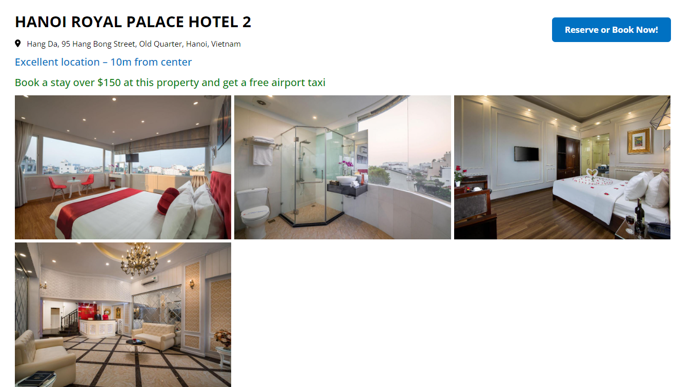
  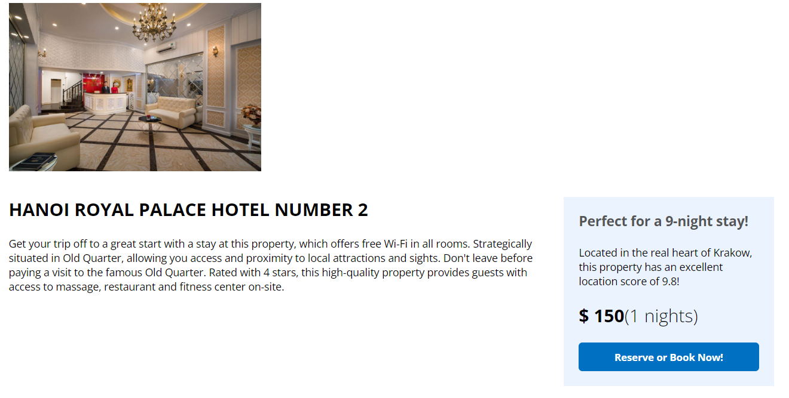
- Booking: Users can make bookings for selected hotels, specifying the number of rooms and guests.
  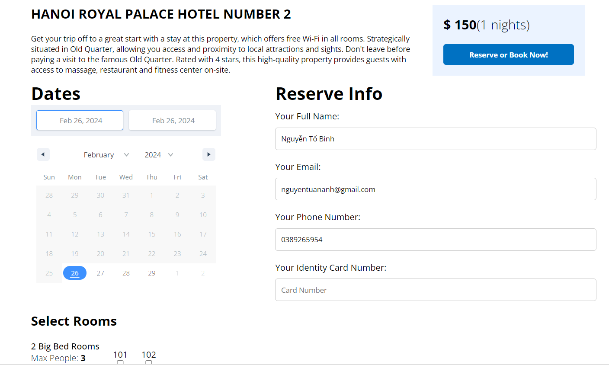
- User transasction
  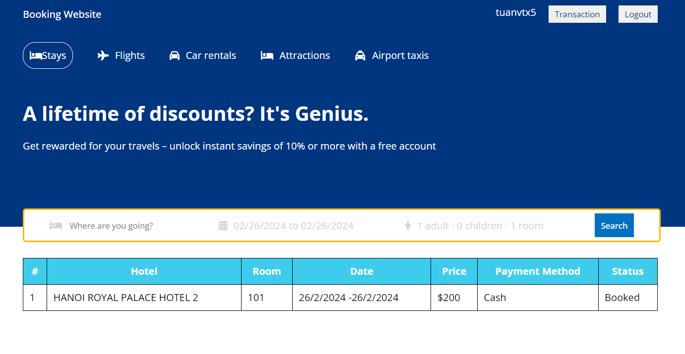
- User authentication: Users can create accounts, log in, and manage their bookings using jsonwebtoken

## Installation

1. Clone the repository: `git clone https://github.com/nguyentobinh12x5/Booking-Hotel.git`
2. Navigate to the client directory: `cd booking-app/client`
3. Install dependencies: `npm install`

## Admin Features

Link github respository: https://github.com/nguyentobinh12x5/Booking-Hotel-Admin
Link UI: https://booking-hotel-admin-tau.vercel.app/

Only user have role as Admin can access admin page

- Dashboard Manager
  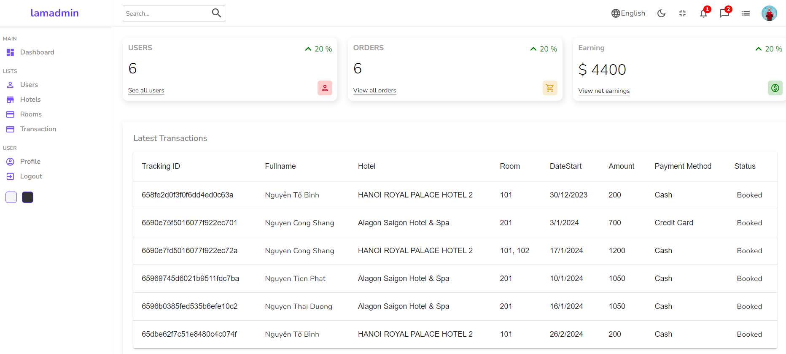
- Add, Edit and Remove Users
  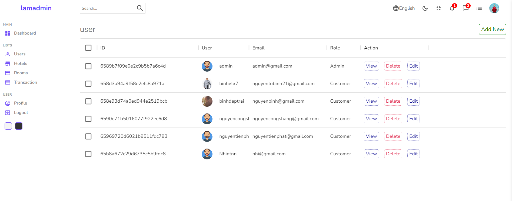
  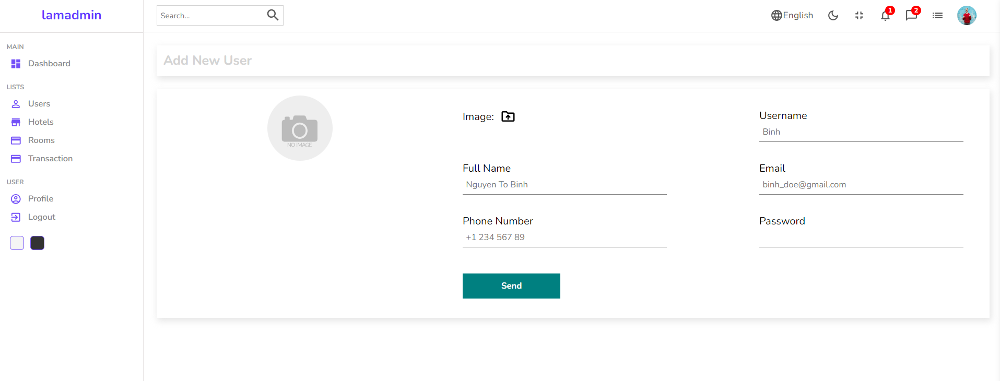
- Add, Edit and Remove Hotels
  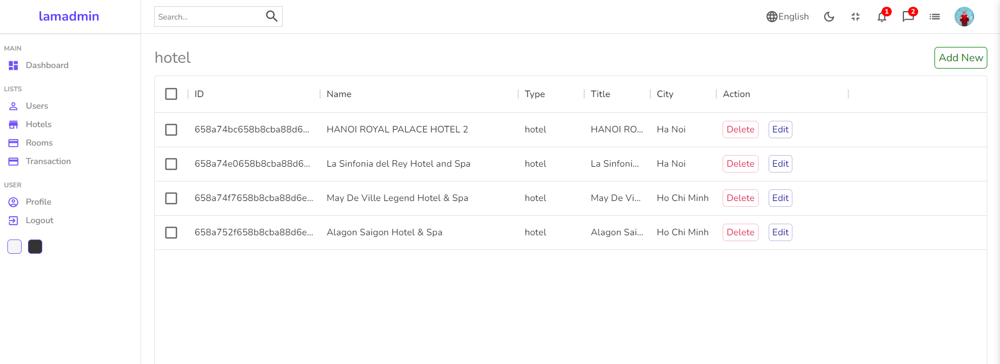
- Add, Edit and Remove Rooms
  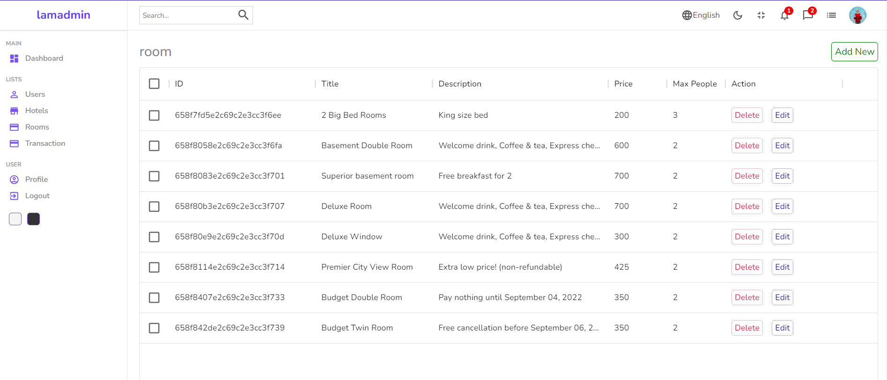
- Add, Edit adn Remove Transaction
  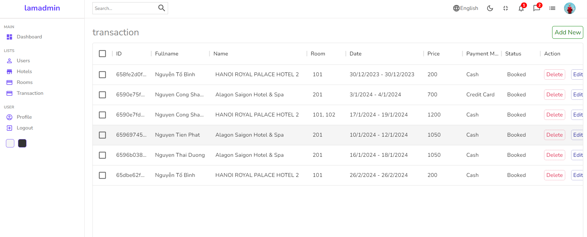

## Usage

Link connect to server: https://booking-hotel-api-u46x.onrender.com
Link github: https://github.com/nguyentobinh12x5/booking-hotel-api.git

1. Start the development server: `npm start`
2. Open your browser and navigate to `http://localhost:3000`

## Contributing

Contributions are welcome! If you find any bugs or have suggestions for improvements, please open an issue or submit a pull request.

## License

This project is licensed under the Nguyen To Binh.

## Contact

For any inquiries or questions, please contact [nguyentobinh12@gmail.com].
